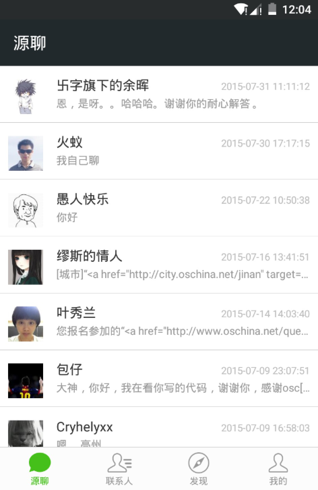
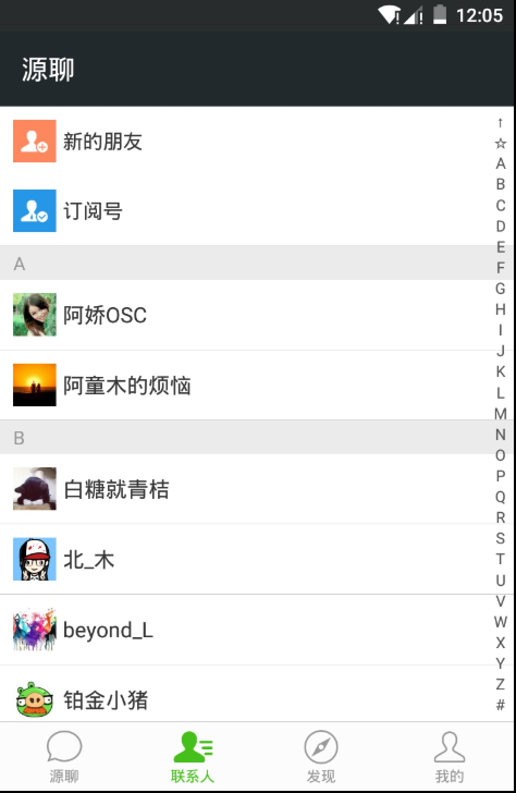
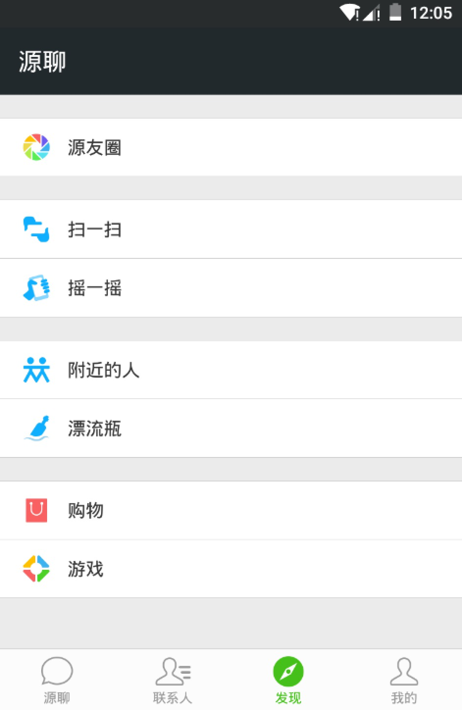
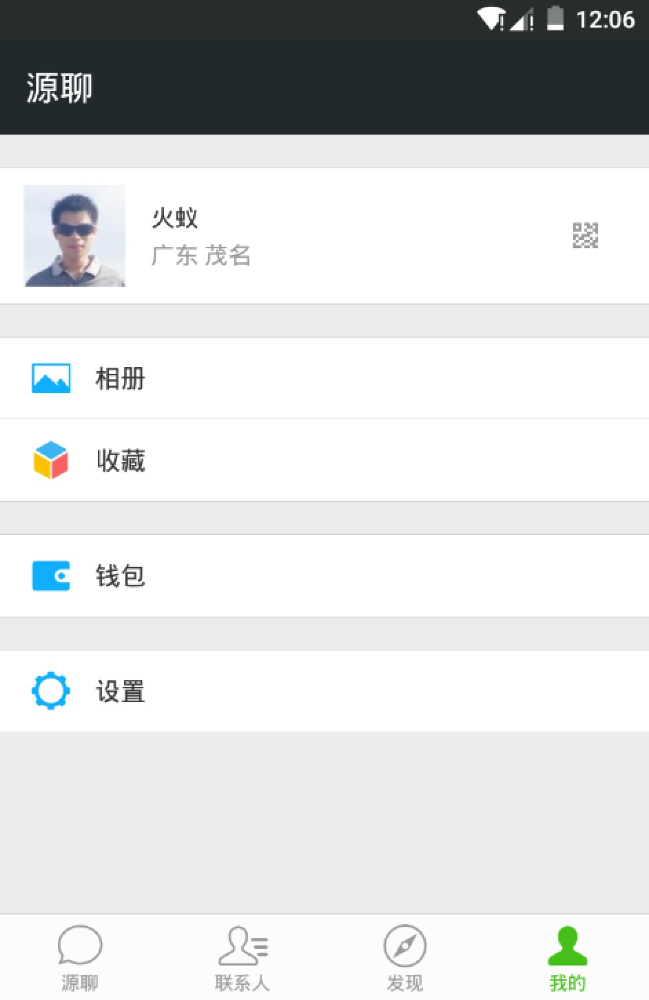
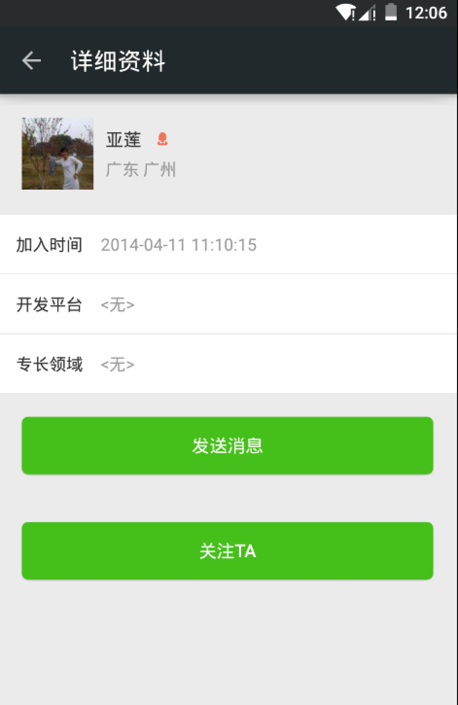
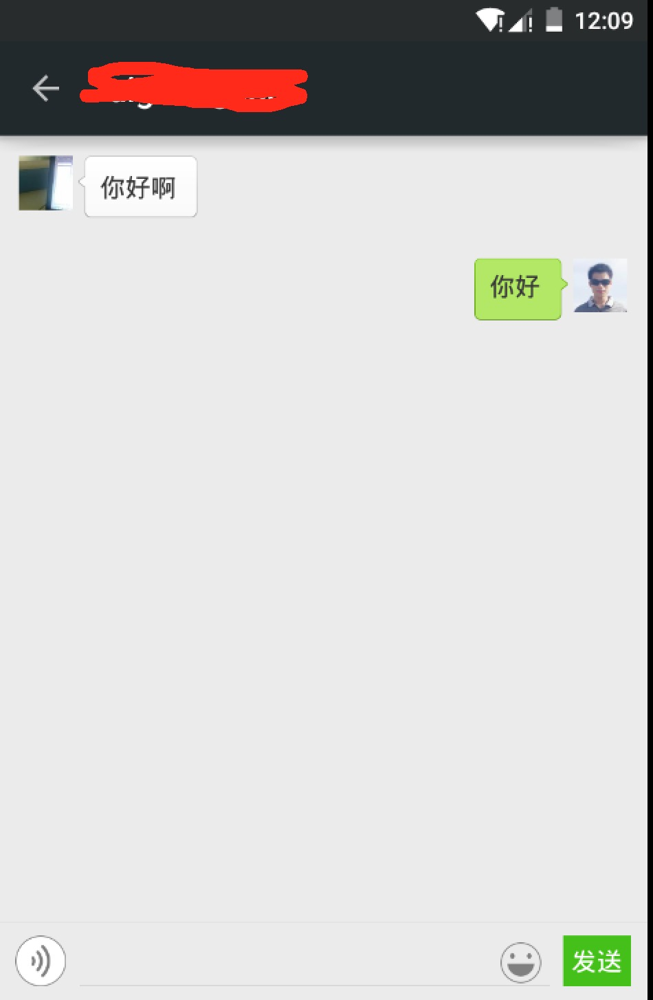

# OpenSourceChat
最近看到有关mvp的文章比较多，所以想在实际的项目中应用一下，所以就诞生了这个将OSC一些零散的东西做成一个简单的微信版本，这样即好玩也能用一用google最近新出的一些控件以及API

项目目前只完成了很小的一部分功能，不过项目的基本结构已经是出来的了

### 下面就这个项目的结构做一个介绍
- adapter（适配器包，这里面有一个通用性极高的通用适配器，基本上每个列表不同新建一个适配器类，直接在界面中new一个commonAdapter即可）
- api（获取数据的api包，这里采用okhttp作为网络请求库，而且能像web开发一样随时进行网络请求调试）
- bean（实体类）
- IPresenter(mvp中的p层接口，先定义好接口方法，具体的p只需要实现这个接口即可)
- IView(mvp中的v层接口，定义一个对view进行操作的接口)
- Presenter(具体实现的p层)
- view(每一个实际的view：activity、fragment这些)
- utils(一些工具类)
- widget(一些自定义的控件)

### 目前已实现的界面效果截图

### 待做功能点列表
- 聊天界面发送消息、加载历史消息
- 开源新闻（这个准备参考微信聊天中嵌入的腾讯新闻）
- 订阅号（这个准备加入的有：高手问答、开源访谈、开源周刊等等一些标签问答）
- 源友圈（这个可以拿个人中心的所有动态来进行显示）

